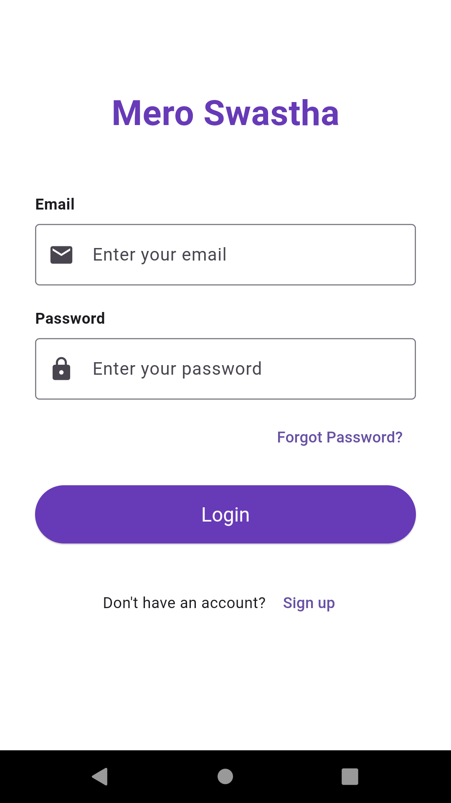
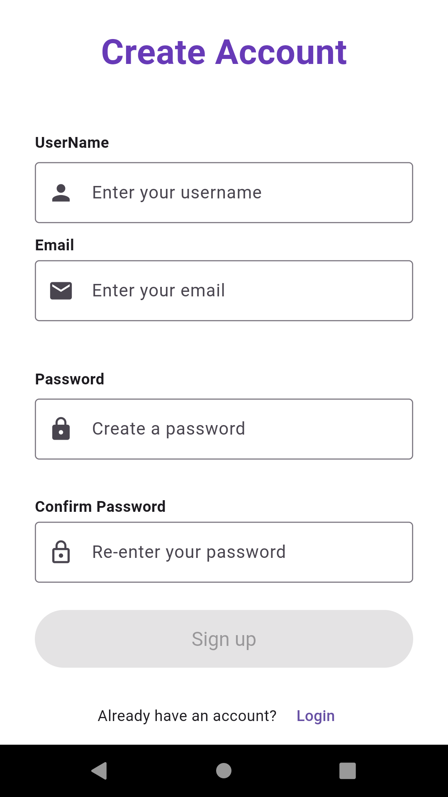
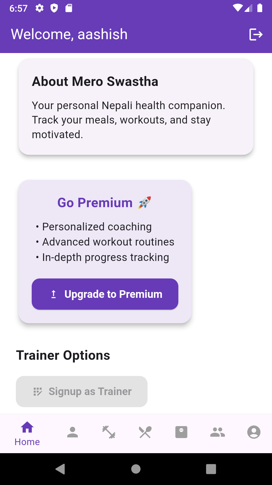
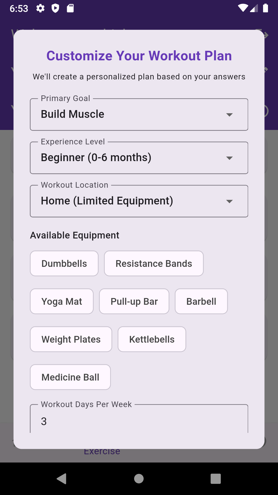
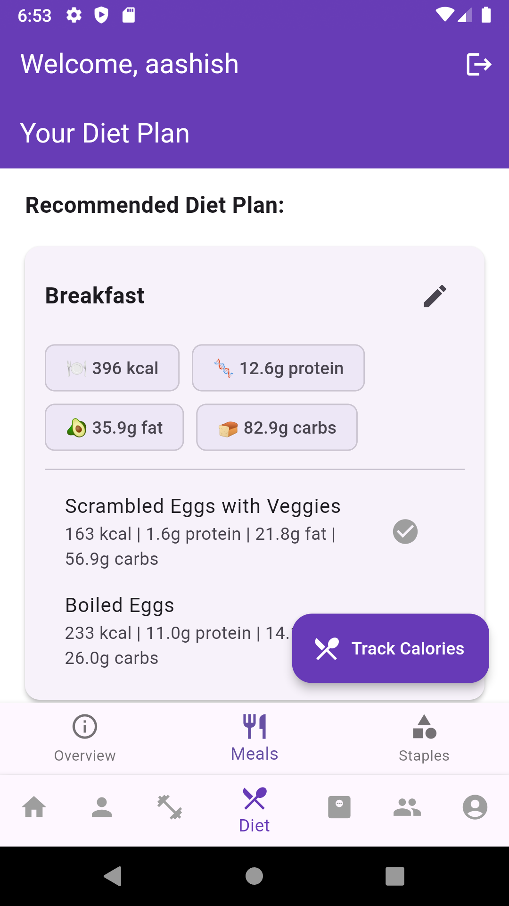
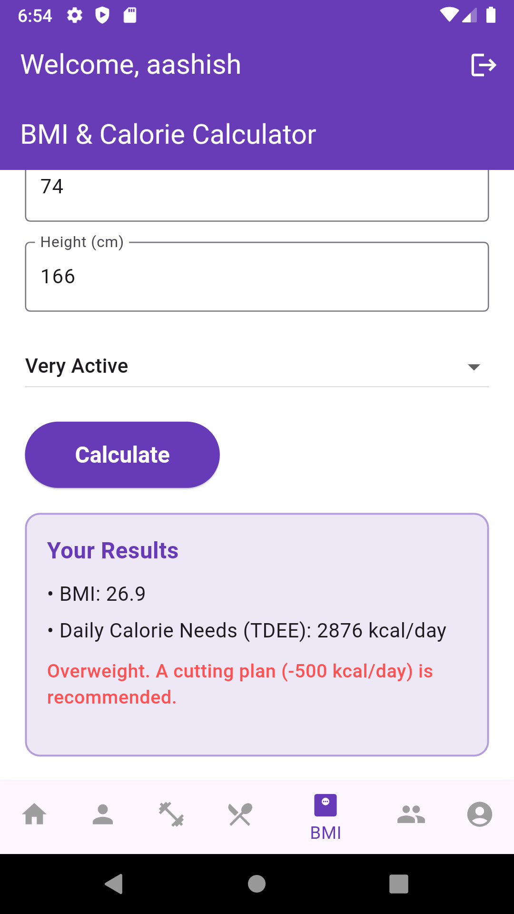

# 🌱 Mero Swastha 🧘‍♂️🍎

**Mero Swastha** is a comprehensive fitness mobile application designed to promote healthier living through **personalized diet plans, exercise routines, BMI tracking, and motivational support**.  
It is built with a focus on **Nepali cuisine**, **budget-friendly diets**, and **accessible fitness guidance**.

---

## ✨ Features
- 📊 **BMI & TDEE Calculator** – calculates based on age, gender, and activity level  
- 🍲 **Dynamic Diet Plans** – personalized and budget-friendly (Low, Medium, High)  
- 🏋️ **Workout Routines** – beginner, intermediate, and advanced workouts  
- 🎯 **Progress Tracking** – stay motivated with goals and milestones  
- 👨‍🏫 **Trainers Section** – connect with fitness trainers and view profiles  
- 🔐 **User Accounts** – easy signup/login with Firebase authentication  

---

## 📱 App UI Preview

<p align="center">
  
  
</p>

<p align="center">
  
  
</p>

<p align="center">
  
  
</p>

<p align="center">
  
  
</p>

---

## 🚀 Getting Started

Follow these steps to run **Mero Swastha** locally:

1. Clone this repository:
   ```bash
   git clone https://github.com/your-username/mero-swastha.git
   cd mero-swastha

    Install Flutter dependencies:

flutter pub get

Connect a device or emulator, then run:

    flutter run

📚 Useful Resources

If you are new to Flutter, these resources will help:

    Write your first Flutter app

Flutter Cookbook

Flutter Documentation
🛠️ Tech Stack

    Flutter – Cross-platform mobile development

    Firebase – Authentication & Firestore Database

    GetX – State management

📌 Future Plans

    📅 Daily motivational tips & reminders

    🥗 AI-powered smart diet recommendations

    📈 More detailed progress analytics

🤝 Contributing

Contributions are welcome!
Feel free to fork this repo and submit a pull request.


---

✅ Once you fix these two things:  
- Add **`.png`** to all image paths  
- Reformat **Getting Started** and other sections properly  

…your README.md will look **professional and clean** on GitHub.  

---

If you want, I can **rewrite your full README.md** now with **all images, Getting Started, features, and sections properly formatted**, so you can just copy-paste it and it’s ready.  

Do you want me to do that?
